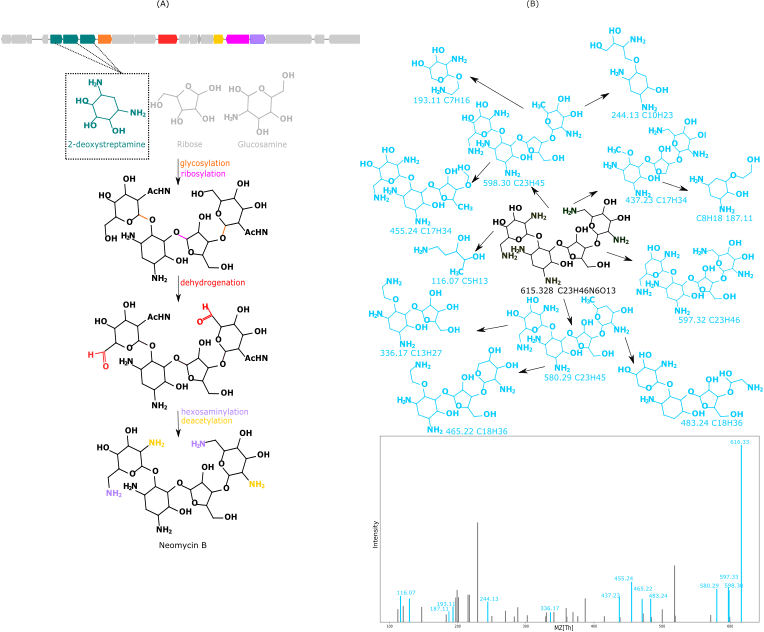

# Seq2Saccharide: Discovering oligosaccharide and aminoglycoside by integrating computational mass spectrometry and genome mining

## Introduction

Natural oligosaccharides and aminoglycosides are vital sources of new drug candidates, particularly antibiotics. In the past, discovering novel (pseudo-)saccharides was both time-consuming and expensive. However, with the rapid growth of high-throughput data, such as genomic and mass spectrometry datasets, there has been a surge in opportunities for natural saccharide discovery. Yet, due to the intricate biosynthesis pathways of saccharides, no existing method can predict their structures with precision. To address this, we introduce Seq2Saccharide, a tool designed to automate natural saccharide discovery by integrating both genomic and mass spectrometry data. To enhance accuracy, Seq2Sachrraride predicts hundreds or thousands of putative structures for each gene cluster, and then the correct structure is identified among these predictions using a mass spectral database search.


## Pre-request
Seq2Saccharide is implemented with Python 3.7.
Some required packages are listed below:
* `Biopython`
* `itertools`
* `pandas`
* `scipy`
* `rdkit`

Also, [Dereplicator+](https://cab.spbu.ru/software/dereplicator-plus/) and [HMMer](http://hmmer.org/) should be installed.

## Seq2Saccharide Pipeline
### Annotating genes in the microbial BGCs
Genes/Enzyme sequences responsible for saccharide monomer synthesis and post-modification are identified from the given BGC by using HMMer. The HMM files used for this HMM search are provided. They are generated following these steps: (1) Collect monomer-synthesis and post-modification enzymes; (2) Blast to find all similar proteins; (3) Use HMMer to build the HMM file.

### Ranking the monomer sets using statistic methods
Based on the enzymes identified from the BGC, different monomer sets which consititute the building blocks of the saccharide are ranked by Fisher or Maximum Likelihood Estimation Method.

### Constructing the saccharide backbones
Connect the monomers based on the pre-defined connection positions.

### Adding post-modifications to the backbones
Use Dereplicator to add structural modifications to the backbone to make it a mature product.

### Searching the spectrum using Dereplicator+
Given a database of chemical structures, Dereplicator+ generates in-silico mass spectra of compounds by predicting how they fragment during mass spectrometry, and compares them to experimental LC/MS-MS and detects similarities. By matching the predicted spectrum of predicted product to the real spectrum, this tool can return the most likely structure to be the true structure from the predicted structure database.

## Run the pipeline
Example command:
To generate all the most possible products with (1) a maximum length of 3; (2) modification depth of 3; (3) 100 most probable monomer sets; (4) at most 2 types of primary metaboliyes (5) no unseen bond types from a BGC sequence via MLE, use
```
python Seq2Saccharide.py --mode run --BGC BGC.fasta --model MLE --out_files Seq2Saccharide_results --bond 0 --length 3 --mod_depth 3 --primary_opt 2 --set_num 100
``` 

All parameter options:
```
running mode: 
  --mode               options are 'run' and 'debug'. Default 'run' mode  automatically deletes intermediate HMM search results files but the 'debug' mode keeps all the generated files for users to easily check.
                        
 
  --if_spec             a bool value to decide whether to include mass spectrum analysis besides generating all possible products, default value is False. If users set it as True, then two additional input files (--mass_spec and --prob) need to be provided.

mode options:
  --model               two built-in models are provided for this tool, including 'Fisher' and 'MLE'. 'Fisher' applies Fisher exact test to filter those products which are more likely to be synthesized from the given BGC sequence, and 'MLE' utilizes maximum likelihood estimation to select these products.

required files options:
  --BGC                 provide a fasta file containing the sequence to be searched.
  --mass_spec           provide a mass spectra file. Only needed if --if_spec is set as True.
  --prob                provide the probability json file used for mass spectrum analysis. Only needed if --if_spec is set as True.
  --mon_cutoff          provide the monomer hmmsearch threshold cutoff csv file.
  --mod_cutoff          provide the modification hmmsearch threshold cutoff csv file.
  --mon_hmm             provide the directory of monomer HMM files.
  --mod_hmm             provide the directory of modification HMM files.
  --connectivity        provide the monomer connectivity pattern database.
  --BGClist             provide the file containing the list of training BGCs.
  --train_BGC_dir       the directory of BGC fasta files for MLE training
  --BGCbackbone         provide BGC backbone database.
  --out_file            users can assign a directory to store those generated files. default is empty.

product options:
  --length              the maximum number of monomers in the final products. default length is 5.
  --mod_depth           the modification depth, which affects how many post-modifications will be added to the products.
  --gene_length         the minimum length of gene in the BGC to be recognized.   
  --bond                the number of unseen bonds to include in the products
  --primary_opt         the number of types of primary metabolites to include in the products
  --set_num             the number of monomer sets to be selected

